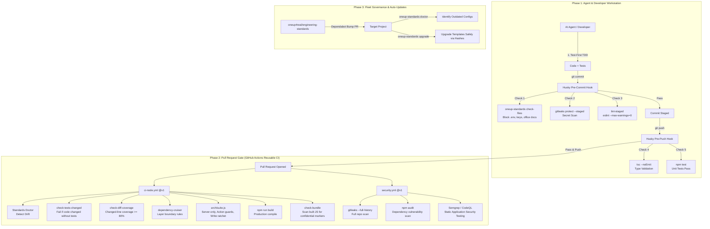
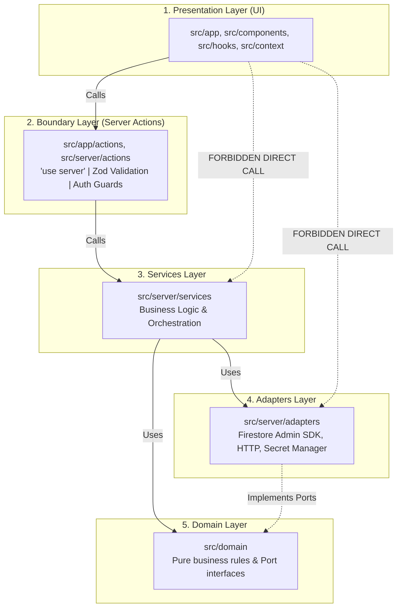
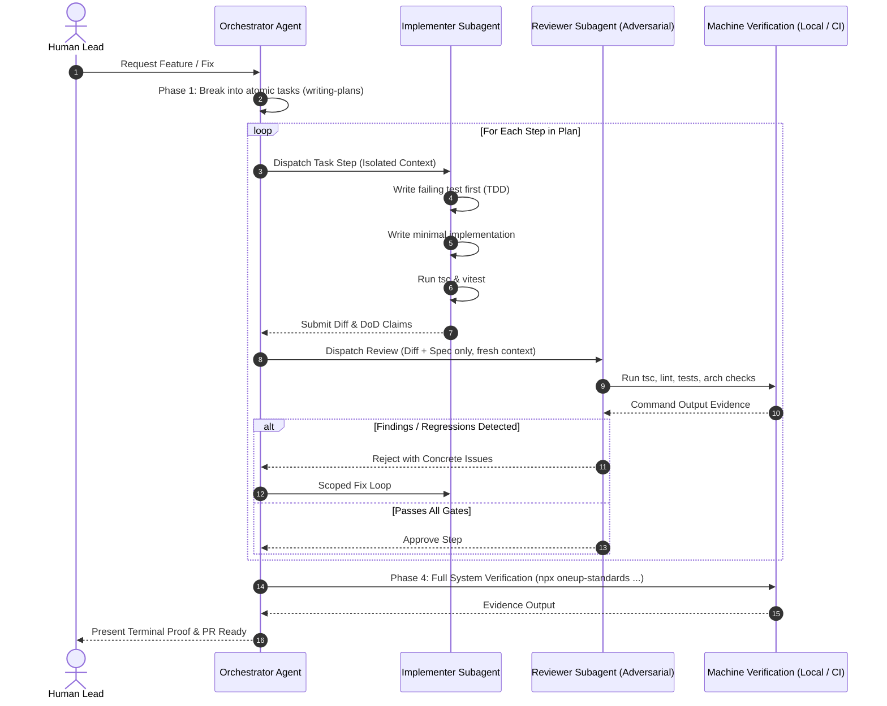
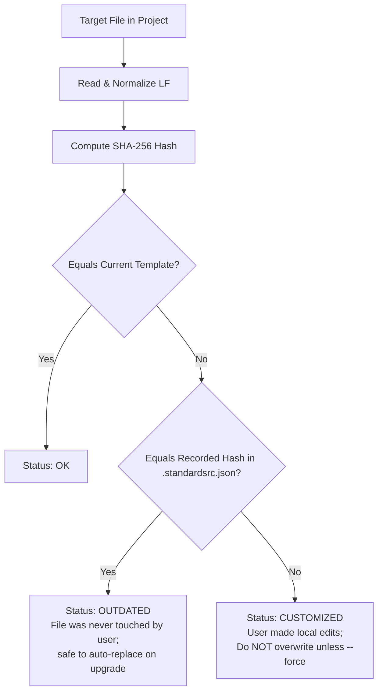

# engineering-standards

**Machine-Enforced Secure SDLC, Architecture Guardrails, and AI-Agent Governance.**

One source of truth for the rules every project must follow. Projects connect once via an interactive setup wizard. From then on, automated checks run before every commit and on every pull request. Central improvements automatically reach every project through standard updates, while anti-drift tooling ensures configurations remain synchronized.

> **The Core Problem in Agentic Coding:** Writing rules into a project's `AGENTS.md` or system prompt is insufficient. AI coding agents (and humans under pressure) read guidelines, hallucinate compliance, take shortcuts, and commit untested or insecure code.
>
> In this repository, **rules are enforced by machines, not polite requests**. If an agent or developer violates architectural boundaries, skips tests, leaves confidential markers in bundles, or omits authorization guards, the commit or the pull request fails deterministically.

---

## Table of Contents

1. [Secure SDLC Architecture & Flow](#1-secure-sdlc-architecture--flow)
2. [Tools Used & Risk Mitigation Matrix](#2-tools-used--risk-mitigation-matrix)
3. [Architectural Guardrails](#3-architectural-guardrails)
4. [Subagent Dual-Control Protocol](#4-subagent-dual-control-protocol)
5. [Quickstart: New Projects](#5-quickstart-new-projects)
6. [Quickstart: Existing Projects](#6-quickstart-existing-projects)
7. [Fleet Anti-Drift: Doctor & Upgrade](#7-fleet-anti-drift-doctor--upgrade)
8. [Make the Checks Mandatory on GitHub](#8-make-the-checks-mandatory-on-github)
9. [What Happens When (Pipeline Breakdown)](#9-what-happens-when-pipeline-breakdown)
10. [A Check Failed. What Now?](#10-a-check-failed-what-now)
11. [CLI Commands Reference](#11-cli-commands-reference)
12. [Importable Building Blocks](#12-importable-building-blocks)
13. [Appendices (Deep Technical Details)](#13-appendices-deep-technical-details)
    - [Appendix A: The Three Delivery Channels](#appendix-a-the-three-delivery-channels)
    - [Appendix B: Cryptographic Anti-Drift Fingerprinting](#appendix-b-cryptographic-anti-drift-fingerprinting)
    - [Appendix C: Monotonic Ratchets for Legacy Migration](#appendix-c-monotonic-ratchets-for-legacy-migration)
    - [Appendix D: TypeScript AST Guard Inspection](#appendix-d-typescript-ast-guard-inspection)
    - [Appendix E: Supply Chain Security & Action Pinning](#appendix-e-supply-chain-security--action-pinning)

---

## 1. Secure SDLC Architecture & Flow

The following diagram illustrates how changes travel from prompt to production across the multi-layered defense-in-depth pipeline:



---

## 2. Tools Used & Risk Mitigation Matrix

Every tool incorporated into `@oneup4real/standards` is targeted at specific real-world security vulnerabilities and common failure modes of AI coding agents:

| Tool / Technology | Execution Point | Specific Threat / AI Failure Mode Prevented | Secure SDLC Impact |
|---|---|---|---|
| **gitleaks** | Pre-commit & CI | AI accidentally commits API keys, Firebase service account credentials, or `.env` files into git history. | **Secrets & Credential Hygiene**: Halts commits locally; audits full git history in CI. |
| **`check-files`** | Pre-commit & CI | AI commits internal documentation (`.docx`, `.pdf`, `.xlsx`), raw keys (`.pem`, `.key`), or local environments. | **Data Leakage & Asset Sprawl**: Rejects disallowed extensions before staging. |
| **ESLint Security Plugin** | Pre-commit & CI | Direct client writes to DB (`setDoc`, `addDoc`), secret access in `NEXT_PUBLIC_*`, `any` type casts, `dangerouslySetInnerHTML`. | **Injection & Authorization Bypass**: Guarantees writes go through server actions; stops client data poisoning. |
| **dependency-cruiser** | CI & Pre-push | UI directly importing server adapters/database modules; circular dependencies; domain layer corruption. | **Architectural Integrity**: Enforces strict boundaries (UI → Boundary → Services → Adapters). |
| **`arch/suite.js` (AST Scanner)** | CI (`tests/arch`) | AI creates exposed Server Actions (`'use server'`) without authentication/role guards (`requireAuth`, `requireRole`). | **Broken Object Level Authorization (BOLA/IDOR)**: Guarantees every exported action has a verified session guard. |
| **`check-tests-changed`** | CI PR Gate | AI refactors or adds application logic but skips writing tests, claiming "it works". | **Regression Prevention & TDD**: PR fails if `src/` changes without matching test modifications. |
| **`check-diff-coverage`** | CI PR Gate | AI writes pseudo-tests that run empty assertions or don't execute newly added logic. | **AI Slop Defense**: Requires at least 80% coverage on newly touched lines. |
| **`check-bundle`** | CI Post-Build | Internal database IDs (e.g. `CUST-`, `INTERNAL-`) or secret constants leaked into client-side JS bundles. | **Information Disclosure**: Scans client JavaScript in `.next/static` for sensitive markers. |
| **Semgrep / CodeQL** | CI Security Pipeline | Known insecure coding patterns, prototype pollution, SSRF, path traversal. | **SAST**: Automated vulnerability scanning on every PR. |
| **`doctor` & `upgrade`** | Local CLI & CI | Configuration drift: projects initialized months ago missing new security patches and hook updates. | **Fleet Consistency**: Cryptographically tracks template drift and provides safe upgrades. |
| **Superpowers Subagent Dual-Control** | Agent Runtime | Single agent "cheating" its own evaluation, hallucinating test results, or deviating from plan. | **Four-Eyes Governance**: Separates the implementer agent from an independent, fresh-context reviewer agent. |

---

## 3. Architectural Guardrails

Applications using these standards follow a strict layered Clean Architecture:



### Invariant Rules
1. **Server-Only Isolation:** Every file in `src/server/` must begin with `import 'server-only';`.
2. **Deny Client Writes:** In Firebase/Firestore apps, client security rules enforce `allow write: if false;`. All mutations go through Server Actions using the Admin SDK.
3. **Domain Purity:** `src/domain` contains only pure logic and interfaces. It may only import `src/domain`, `src/shared`, or `zod`. No framework, UI, or database imports.
4. **Action Contract:** All server actions return a unified response shape:
   ```ts
   type ActionResult<T> =
     | { success: true; data: T }
     | { success: false; error: string; code?: string };
   ```

---

## 4. Subagent Dual-Control Protocol

When AI coding tools (Claude Code, Antigravity, Cursor, Codex) execute non-trivial tasks in projects using `@oneup4real/standards`, they are bound by the **Subagent Dual-Control Protocol** defined in `AGENTS.global.md`:



### Core Rules for AI Agents
- **No Self-Approval:** The agent that writes the implementation code must never approve its own step.
- **Fresh-Context Skeptical Reviewer:** The reviewer subagent is launched with isolated context (only the spec, plan step, and git diff), preventing confirmation bias inherited from conversation history.
- **Evidence Before Assertions:** Phrases like "this should work" or "all tests pass" are rejected without terminal output proof.

---

## 5. Quickstart: New Projects

Create your project, initialize git, and run the wizard:

```bash
npx create-next-app@latest my-app
cd my-app
git init
npm install --save-dev github:oneup4real/engineering-standards#semver:^1.0.0
npx oneup-standards init
```

The interactive wizard asks 8 clear questions, selects recommended Secure SDLC settings, writes configs, and installs hooks. (Pass `--yes` to accept all recommended defaults non-interactively).

---

## 6. Quickstart: Existing Projects

You can bring legacy codebases under standards governance without turning your entire CI pipeline red on day one:

```bash
# Step 1: Install standards package directly from GitHub
npm install --save-dev github:oneup4real/engineering-standards#semver:^1.0.0

# Step 2: Run interactive wizard (merges configs, never blindly overwrites)
npx oneup-standards init

# Step 3: Install secret scanner
brew install gitleaks     # Windows: winget install gitleaks

# Step 4: Record existing architecture violations (The Ratchet)
npx oneup-standards baseline

# Step 5: Configure sensitive markers in .standardsrc.json
# Add prefixes like "CUST-" or "INTERNAL-" that must never appear in client JS bundles

# Step 6: Commit and push
git add -A
git commit -m "chore: adopt engineering-standards"
git push
```

From this point forward, **only new violations fail**. Existing legacy violations are frozen in `.dependency-cruiser-known-violations.json` and can be resolved incrementally over time.

---

## 7. Fleet Anti-Drift: Doctor & Upgrade

As `@oneup4real/standards` evolves, how do you prevent older projects from becoming out-of-date?

### Diagnose with `doctor`

Run `doctor` to inspect your repository's files, git hooks, AI agent blocks, and environment readiness:

```bash
npx oneup-standards doctor
```

Output:
```
Standards drift / issues detected:
  outdated     .github/pull_request_template.md    older version that was never edited; `upgrade` replaces it
  missing      .lintstagedrc.json                  missing; `upgrade` adds it
  missing      package.json                        missing scripts: check:arch; `upgrade` adds them

Run `npx oneup-standards upgrade` to synchronize configuration files.
```

In CI, `oneup-standards doctor --warn-only` runs automatically on pull requests to highlight drift without failing the build.

### Safe Synchronization with `upgrade`

The `upgrade` command automatically updates outdated templates, creates missing files, appends missing hook lines, and refreshes the managed AI rules block in `AGENTS.md`:

```bash
# Preview changes without modifying disk:
npx oneup-standards upgrade --dry-run

# Apply safe upgrades:
npx oneup-standards upgrade

# Force replacement of customized files (creates .bak backups):
npx oneup-standards upgrade --force
```

> **Safety Guarantee:** `upgrade` uses cryptographic SHA-256 fingerprints stored in `.standardsrc.json`. It will **never** overwrite a template file that you customized locally, unless you explicitly pass `--force`.

---

## 8. Make the Checks Mandatory on GitHub

Local hooks catch mistakes on your machine, but GitHub branch protection prevents anyone (human or agent) from bypassing them with `--no-verify`.

### 1. Branch Ruleset (Repository Settings → Rules → Rulesets)
Create a ruleset targeting the default branch:
- ✅ **Restrict deletions**
- ✅ **Block force pushes**
- ✅ **Require a pull request before merging**
- ✅ **Require status checks to pass:**
  - `ci / ci`
  - `security / gitleaks`
  - `security / audit`
  - `security / semgrep` (or `security / codeql`)

### 2. Code Security (Repository Settings → Code security)
- Enable **Secret scanning** and **Push protection**.

*(If you have the GitHub CLI installed, `npx oneup-standards init` can automatically create this ruleset for you).*

---

## 9. What Happens When (Pipeline Breakdown)

| Event | Execution Target | Checks Executed | Fail Conditions |
|---|---|---|---|
| `git commit` | Local Machine (`.husky/pre-commit`) | `check-files`, `gitleaks protect`, `lint-staged` | Staged keys/env files, exposed credentials, lint errors. |
| `git push` | Local Machine (`.husky/pre-push`) | `tsc --noEmit`, `npm test` | TypeScript type errors, failing unit tests. |
| **Pull Request (CI Pipeline)** | GitHub Actions (`ci-node.yml`) | • Standards doctor drift scan<br>• Forbidden file audit<br>• ESLint (`--max-warnings=0`)<br>• TypeScript compile<br>• Vitest with coverage<br>• `check-tests-changed` (TDD)<br>• `check-diff-coverage` (≥80%)<br>• dependency-cruiser layers<br>• `arch/suite.js` (action guards & write ratchets)<br>• Production build<br>• `check-bundle` confidential scanner | Any warning or error, missing tests on source edits, diff coverage < 80%, layer violations, unguarded server actions, confidential bundle leaks. |
| **Pull Request (Security)** | GitHub Actions (`security.yml`) | • Pinned Gitleaks full history audit<br>• `npm audit`<br>• Semgrep SAST / CodeQL<br>• Dependency review | Leaked secrets anywhere in git history, high/critical CVEs, insecure AST patterns. |
| **Weekly** | Dependabot | Weekly check for new `@oneup4real/standards` releases | Outdated central standards package. |

---

## 10. A Check Failed. What Now?

| Failure Message / Symptom | Root Cause | Proper Remediation |
|---|---|---|
| `These files must not be committed` | A `.docx`, `.xlsx`, `.pdf`, `.env`, or credential file was staged. | Run `git restore --staged <file>`. Store documents in secure document management (SharePoint/Drive) and secrets in Secret Manager. |
| `gitleaks found a possible secret` | Secret or API key detected in staged diff or commit history. | Remove from file. If it was ever committed to history, **revoke and rotate the credential immediately**. |
| `UI code must not write to the database` | Direct Firestore/DB mutation (`setDoc`, `addDoc`) inside UI component. | Move the database mutation behind a Server Action (`src/app/actions`) and Service (`src/server/services`). |
| `exported action "x" has no guard call` | Exported `'use server'` function lacks an authentication guard. | Invoke `await requireAuth()` or `await requireRole('admin')` at the beginning of the function, or mark explicitly with `// @public-action: <reason>`. |
| `missing import 'server-only'` | Server file can be leaked into browser bundle. | Add `import 'server-only';` as the first line of the file. |
| `Source code changed, but no test file changed` | Modified application logic without adding or updating tests. | Write the failing test first. If truly non-functional (e.g. pure docs/copy change), add the PR label `no-tests-needed`. |
| `Changed-line coverage ... is below 80%` | Newly added lines of code are not exercised by tests. | Add test cases specifically covering the uncovered lines shown in the CI terminal output. |
| `Confidential data found in the client bundle` | Sensitive marker (e.g. `CUST-`) compiled into `.next/static`. | Remove client import of server-side data models; pass only sanitized view models across the wire. |
| `shrink the entry in arch-allowlist.json` | You eliminated legacy direct DB writes! | Decrease the count in `arch-allowlist.json`. The ratchet only allows downward movement. |

> **Critical Rule:** Never bypass checks using `git commit --no-verify`, disable rules in ESLint, or inflate ratchet numbers. Fix the underlying code.

---

## 11. CLI Commands Reference

All commands are available via `npx oneup-standards <command>`:

| Command | Arguments / Flags | Description |
|---|---|---|
| `init` | `[--yes]` | Interactive setup wizard for new or existing projects (`--yes` accepts recommended answers). |
| `doctor` | `[--warn-only]` | Diagnoses configuration drift, missing hooks, outdated templates, and environment status. |
| `upgrade` | `[--force] [--dry-run]` | Safely synchronizes template files, hooks, and AI rules. Uses `--force` to replace customized files. |
| `baseline` | none | Generates `.dependency-cruiser-known-violations.json` from current code to ratchet existing architectural violations. |
| `sync-agents` | `[--global]` | Refreshes managed shared rules in `AGENTS.md`, `CLAUDE.md`, and `GEMINI.md` (`--global` updates `~/.agents/AGENTS.md`). |
| `check-files` | `[paths...]` | Fails if specified paths (default: staged files) contain office docs, keys, or `.env` files. |
| `check-bundle` | `[--dir <path>]` | Scans production JavaScript bundles for confidential markers configured in `.standardsrc.json`. |
| `check-tests-changed` | `--base <git-ref>` | Enforces TDD by failing if source code changed without corresponding test modifications. |
| `check-diff-coverage` | `--base <ref> [--min 80]` | Fails if newly added or modified lines have less than the required test coverage percentage. |
| `hook` | `pre-commit \| pre-push` | Executes git hook sequences orchestrated by Husky. |

---

## 12. Importable Building Blocks

Projects consuming `@oneup4real/standards` can import standard presets directly:

| Import Path | Type | Description |
|---|---|---|
| `@oneup4real/standards/eslint/nextjs` | ESLint Config | Next.js flat ESLint preset with security rules, strictness, and React hooks validation. |
| `@oneup4real/standards/eslint/base` | ESLint Config | Framework-agnostic base ESLint configuration. |
| `@oneup4real/standards/tsconfig/nextjs.json` | TSConfig | Strict TypeScript compiler settings for Next.js applications. |
| `@oneup4real/standards/tsconfig/base.json` | TSConfig | Strict base TypeScript settings (`noImplicitAny`, `strictNullChecks`). |
| `@oneup4real/standards/depcruise/layered` | Dependency Cruiser | Clean Architecture layer dependency validation rules. |
| `@oneup4real/standards/vitest` | Vitest Config | Preset configuring coverage thresholds (≥90% domain coverage) and reporting. |
| `@oneup4real/standards/arch/suite` | Arch Test Kit | `defineArchSuite()`: Automates checks for `server-only`, Action guards, and write ratchets. |
| `@oneup4real/standards/firebase-testing` | Test Helpers | Firebase emulator testing utilities (`assertEmulator`, `createRulesEnv`, `withRoles`). |
| `@oneup4real/standards/next/headers` | Next Config | Production security headers (`securityHeaders({ firebase: true })`) including CSP, HSTS, and XFO. |

---

## 13. Appendices (Deep Technical Details)

### Appendix A: The Three Delivery Channels

`@oneup4real/standards` does not require publishing to the public npm registry or managing private registry tokens:

```
  engineering-standards (GitHub)                        your project
  ─────────────────────────────                        ────────────────────────────────────────────
  ① npm package  @oneup4real/standards   ── npm install ──▶  node_modules/@oneup4real/standards/
     (CLI, configs, checks, AST scanners)                    + one line in package.json
                                                              + exact commit pinned in package-lock.json

  ② reusable CI workflows                ◀── fetched by GitHub ── .github/workflows/ci.yml
     .github/workflows/ci-node.yml             on every run        ("uses: …/ci-node.yml@v1")
     .github/workflows/security.yml

  ③ small files written ONCE by wizard  ─────────────▶  eslint.config.mjs, .husky/pre-commit,
     (managed via doctor & upgrade)                          AGENTS.md block, .standardsrc.json …
```

1. **Git Dependency:** Installed via `"@oneup4real/standards": "github:oneup4real/engineering-standards#semver:^1.0.0"`. npm downloads the tarball directly from GitHub matching the semver range. `package-lock.json` pins the immutable git commit SHA.
2. **Reusable Workflows:** Reference `uses: oneup4real/engineering-standards/.github/workflows/ci-node.yml@v1`. The `@v1` tag points to the latest stable 1.x release, allowing immediate distribution of CI security patches without requiring PRs in individual repos.
3. **Managed Consumer Pointers:** Tiny files pointing back to ① and ②.

---

### Appendix B: Cryptographic Anti-Drift Fingerprinting

To solve configuration drift without destroying developer customizations, `lib/doctor.js` and `lib/templates.js` implement SHA-256 fingerprint tracking:



- When the wizard writes a template, it records `managed[relFile] = "sha256:..."` in `.standardsrc.json`.
- `upgrade` replaces `outdated` files automatically.
- `customized` files are protected; running `upgrade --force` replaces them but preserves an exact backup copy as `<file>.bak`.

---

### Appendix C: Monotonic Ratchets for Legacy Migration

Adopting strict architectural standards in large, pre-existing codebases is often blocked by thousands of pre-existing violations. The Ratchet pattern solves this:

1. **Architecture Violations (`.dependency-cruiser-known-violations.json`):**
   Generated by `npx oneup-standards baseline`. CI runs `depcruise --ignore-known`. If new illegal imports are introduced, CI fails. As old imports are deleted, the baseline file shrinks.
2. **Direct DB Write Ratchet (`arch-allowlist.json`):**
   Tracks allowed direct DB writes per file. If a developer attempts a new direct write outside of a service, the count exceeds the allowlist and CI fails:
   $$\text{violations}(file) \le \text{allowlist}(file)$$
   If an engineer refactors a file and reduces writes from 3 to 1, the test suite asserts:
   $$\text{violations}(file) < \text{allowlist}(file) \implies \text{FAIL: Shrink entry in arch-allowlist.json}$$
   The ratchet is mathematically monotonic: it can only ever decrease.

---

### Appendix D: TypeScript AST Guard Inspection

`arch/index.js` employs TypeScript's native Compiler API (`ts.createSourceFile`) to inspect exported functions in `'use server'` files:

1. It parses every exported arrow function, function declaration, and variable statement.
2. It walks the Abstract Syntax Tree (AST) down to find call expressions.
3. It validates that the first executable statements invoke an authorization guard matching the configured pattern (e.g. `/^(requireAuth|requireRole|assertUser)/`).
4. If an action is intentionally unauthenticated, it requires an explicit leading comment matching `// @public-action: <explanation>`, ensuring that every unauthenticated boundary is documented and auditable.

---

### Appendix E: Supply Chain Security & Action Pinning

In compliance with enterprise Secure SDLC standards (ISO 27001, SOC 2, SLSA):
- **Immutable Action Pinning:** All third-party GitHub Actions referenced across reusable workflows are pinned to full 40-character commit SHAs, never mutable branch or version tags:
  ```yaml
  # Vulnerable:
  uses: actions/setup-node@v4
  # Enforced by engineering-standards:
  uses: actions/setup-node@820762786026740c76f36085b0efc47a31fe5020 # v7.0.0
  ```
- **Pinned Secret Scanner Binary:** Rather than using third-party composite actions that may execute untrusted node dependencies, `security.yml` downloads the official `gitleaks` binary directly from GitHub releases, validates its cryptographic SHA-256 checksum, and executes it in isolation.
