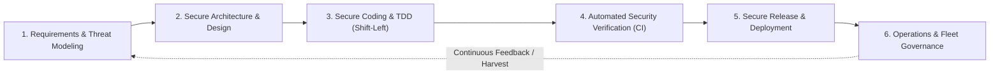
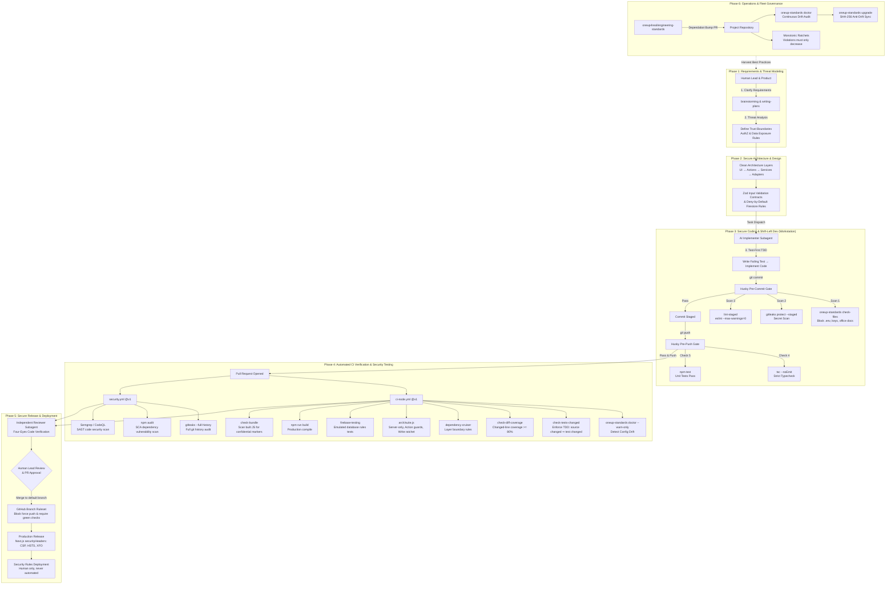
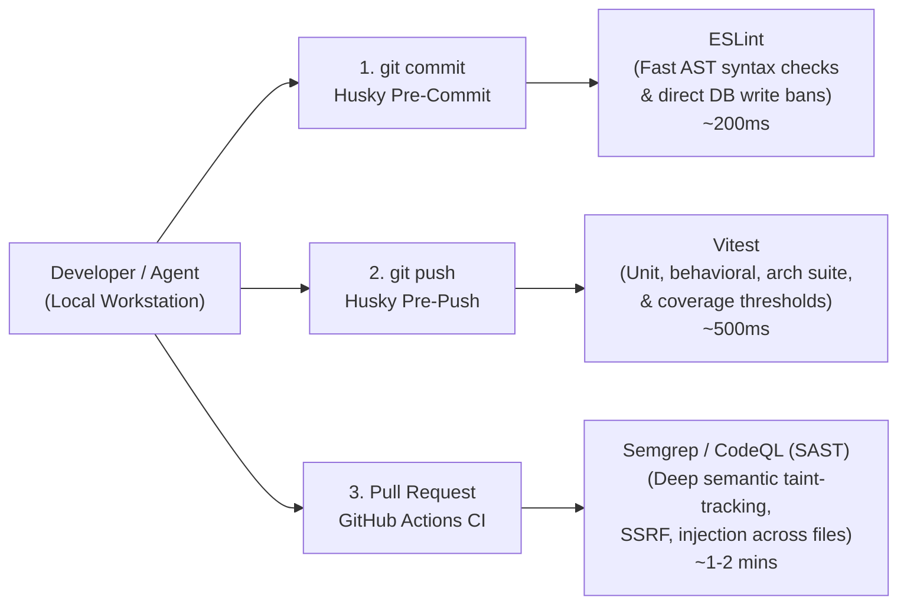
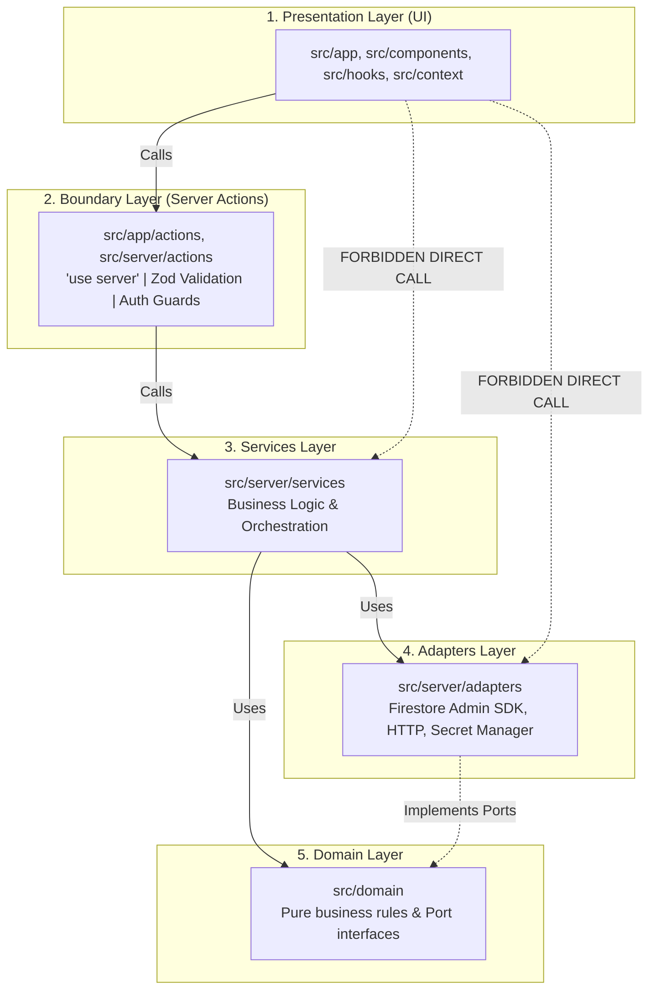
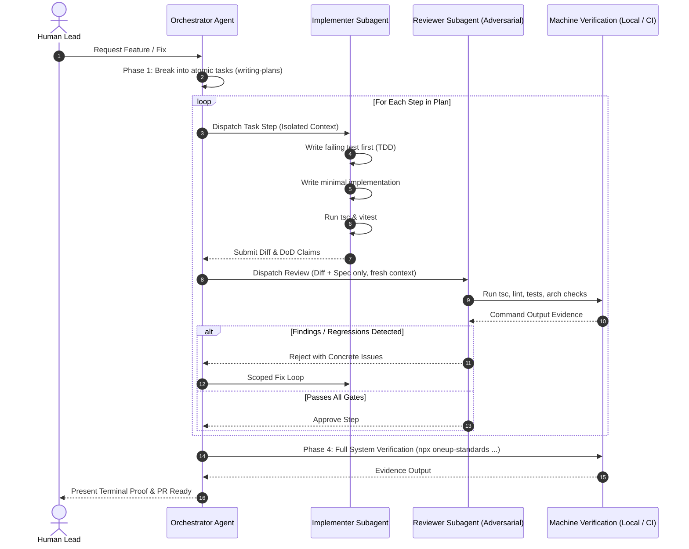
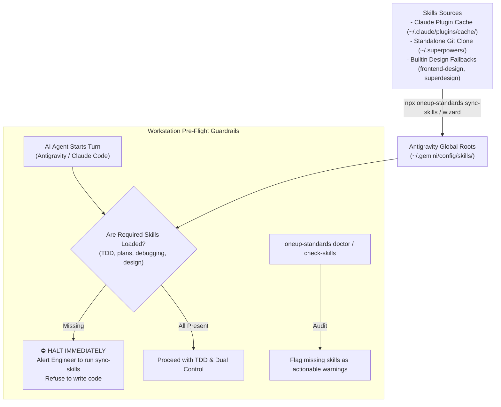
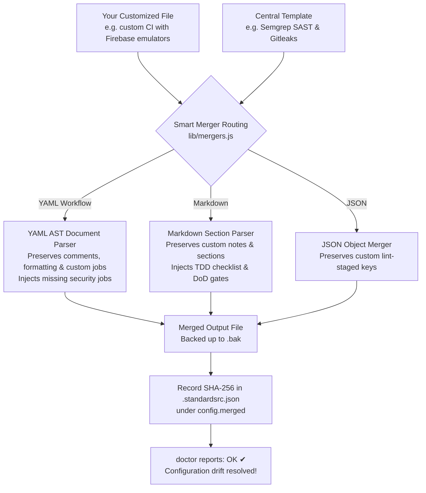
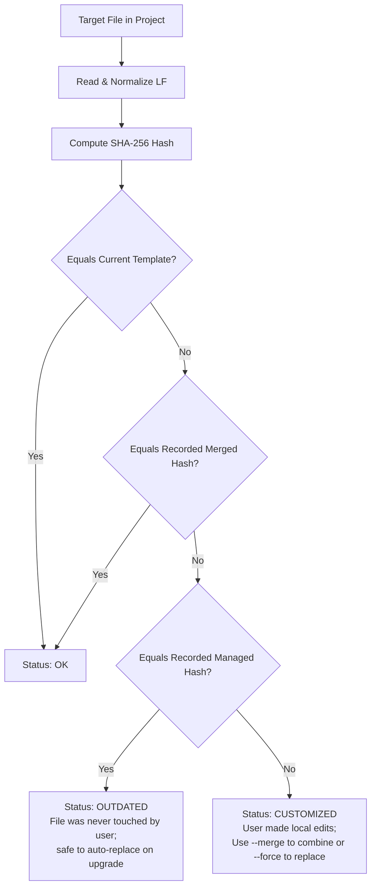
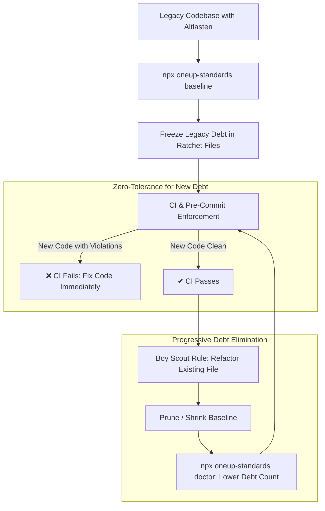

# engineering-standards

**Machine-Enforced Secure SDLC, Architecture Guardrails, and AI-Agent Governance.**

One source of truth for the rules every project must follow. Projects connect once via an interactive setup wizard (`npx oneup-standards init`). From then on, automated checks run before every commit and on every pull request. Central improvements automatically reach every project through standard updates, while anti-drift tooling ensures configurations remain synchronized.

### 🎯 Primary Harness & Universal Compatibility

- **Built Primarily For:** **Google Antigravity IDE** and **Claude Code CLI within Antigravity**. Antigravity is a premier harness for autonomous agentic engineering; running Claude models inside Antigravity introduces unique host-sandbox boundaries and plugin isolation constraints. This framework was built from the ground up to automate cross-harness skill synchronization (`~/.gemini/config/skills`), manage subagent dual-control protocols, and enforce zero-forget pre-flight checks in Antigravity sessions.
- **Works Seamlessly Across Other Setups:** While optimized for Antigravity, `@oneup4real/standards` is **100% harness-agnostic at its core**. It runs equally well in:
  - **Standalone Claude Code CLI** (Terminal / zsh / bash)
  - **Cursor, VS Code, & Windsurf** (via standard Git hooks, flat ESLint, TypeScript, and `AGENTS.md`)
  - **GitHub Codespaces & Cloud Dev Environments**
  - **Headless CI/CD Pipelines** (GitHub Actions, GitLab CI)

Because guardrails are enforced by deterministic machine gates (Husky pre-commit, Gitleaks, AST parsers, Vitest, and ESLint) rather than IDE-specific plugins, your security baseline holds true regardless of whether your team codes in Antigravity, Cursor, or raw terminal sessions.

> **The Core Problem in Agentic Coding:** Writing rules into a project's `AGENTS.md` or system prompt is insufficient. AI coding agents (and humans under pressure) read guidelines, hallucinate compliance, take shortcuts, and commit untested or insecure code.
>
> In this repository, **rules are enforced by machines, not polite requests**. If an agent or developer violates architectural boundaries, skips tests, leaves confidential markers in bundles, or omits authorization guards, the commit or the pull request fails deterministically.

---

## Table of Contents

1. [Secure SDLC (SSDLC) Phase Mapping](#1-secure-sdlc-ssdlc-phase-mapping)
2. [SSDLC Pipeline & Architecture Flow](#2-ssdlc-pipeline--architecture-flow)
3. [Tools Used & Risk Mitigation Matrix](#3-tools-used--risk-mitigation-matrix)
    - [Defense-in-Depth: SAST vs. Linting vs. Testing](#defense-in-depth-sast-vs-linting-vs-testing)
4. [Architectural Guardrails & Threat Boundaries](#4-architectural-guardrails--threat-boundaries)
5. [Subagent Dual-Control Protocol](#5-subagent-dual-control-protocol)
6. [Cross-Harness AI Skill Governance (Antigravity & Claude Code)](#6-cross-harness-ai-skill-governance-antigravity--claude-code)
7. [Quickstart: New Projects](#7-quickstart-new-projects)
8. [Quickstart: Existing Projects](#8-quickstart-existing-projects)
9. [Fleet Anti-Drift: Doctor & Upgrade](#9-fleet-anti-drift-doctor--upgrade)
    - [Smart Non-Destructive Merging (`--merge`)](#smart-non-destructive-merging-merge)
10. [Make the Checks Mandatory on GitHub](#10-make-the-checks-mandatory-on-github)
11. [What Happens When (Pipeline Breakdown)](#11-what-happens-when-pipeline-breakdown)
12. [A Check Failed. What Now?](#12-a-check-failed-what-now)
13. [CLI Commands Reference](#13-cli-commands-reference)
14. [Importable Building Blocks](#14-importable-building-blocks)
15. [Appendices (Deep Technical Details)](#15-appendices-deep-technical-details)
    - [Appendix A: The Three Delivery Channels](#appendix-a-the-three-delivery-channels)
    - [Appendix B: Cryptographic Anti-Drift Fingerprinting](#appendix-b-cryptographic-anti-drift-fingerprinting)
    - [Appendix C: Monotonic Ratchets for Legacy Migration](#appendix-c-monotonic-ratchets-for-legacy-migration)
    - [Appendix D: TypeScript AST Guard Inspection](#appendix-d-typescript-ast-guard-inspection)
    - [Appendix E: Supply Chain Security & Action Pinning](#appendix-e-supply-chain-security--action-pinning)


---

## 1. Secure SDLC (SSDLC) Phase Mapping

`@oneup4real/standards` aligns modern AI-assisted engineering with the classical **Secure Software Development Lifecycle (SSDLC)** (NIST SSDF SP 800-218, OWASP SAMM, Microsoft SDL):



### Detailed Phase Breakdown

| SSDLC Phase | Classical Activities (NIST / OWASP) | Threats & AI Failure Modes Mitigated | Enforcement Mechanism & Tools Used | Responsibility / Gate |
|---|---|---|---|---|
| **1. Requirements & Threat Modeling** | • Abuse case modeling<br>• Trust boundary definition<br>• Security requirements & compliance scope (GDPR/ISO 27001) | AI agents implementing features without considering auth boundaries, data privacy, or business logic abuse. | • `brainstorming` skill<br>• `writing-plans` (formal spec before code)<br>• Definition of Done (`AGENTS.global.md`) | **Human & AI Alignment**:<br>Human approves spec and acceptance criteria before implementation begins. |
| **2. Secure Architecture & Design** | • Layered defense-in-depth<br>• Principle of Least Privilege<br>• Server-side token verification<br>• Zero-trust database design | Architecture erosion; UI components directly mutating databases; bypass of server-side authorization. | • `depcruise/layered.cjs` (Clean Architecture)<br>• Server action isolation (`src/server/actions`)<br>• Deny-by-default Firestore rules (`allow write: if false`) | **Architectural Rules**:<br>Machine-checked layer boundaries; domain layer remains pure. |
| **3. Secure Coding & Shift-Left Dev** | • Test-Driven Development (TDD)<br>• Secret scanning on staged changes<br>• Static linting of security rules<br>• Strict typing & type safety | AI hallucinating code without tests; committing credentials, `.env` files, or internal PDFs; using `any` or `dangerouslySetInnerHTML`. | • **Husky hooks** (`pre-commit`, `pre-push`)<br>• **Gitleaks** (`gitleaks protect --staged`)<br>• `oneup-standards check-files`<br>• **ESLint Security Plugin** (`@oneup4real/standards/eslint/nextjs`)<br>• Strict TS (`tsconfig/nextjs.json`) | **Pre-Commit Gate**:<br>Local commit fails immediately if secrets, forbidden files, or lint errors are present. |
| **4. Automated Security Verification (CI)** | • **SAST** (Static Application Security Testing)<br>• **SCA** (Software Composition Analysis)<br>• **AST Guard Inspection**<br>• **TDD & Diff Coverage**<br>• **Bundle Leak Detection**<br>• **Emulated Rules Testing** | Unguarded server endpoints; vulnerable dependencies; untested edge cases; sensitive markers in browser JavaScript. | • **SAST**: Semgrep / GitHub CodeQL<br>• **SCA**: `npm audit` + Dependabot<br>• **AST Security**: `arch/suite.js` (Action auth guards)<br>• **TDD Gates**: `check-tests-changed` & `check-diff-coverage >= 80%`<br>• **Bundle Audit**: `check-bundle`<br>• **Emulated Testing**: `@oneup4real/standards/firebase-testing` against local emulator | **Pull Request Gate**:<br>Automated reusable CI (`ci-node.yml`, `security.yml`). Unchecked code cannot merge. |
| **5. Secure Release & Deployment** | • Branch protection<br>• Release gating & Four-Eyes principle<br>• Production security headers<br>• Blast radius containment | Unreviewed AI code pushed directly to production; missing HTTP defense headers; unintended rule deployment. | • GitHub Rulesets (block force push, require PRs & green checks)<br>• Next.js `securityHeaders` (CSP, HSTS, XFO)<br>• Human-only deployment rule for database security rules | **Release Gate**:<br>Human-in-the-loop review; status checks must pass; security rules deployed only by humans. |
| **6. Operations & Fleet Governance** | • Anti-drift management<br>• Vulnerability patching<br>• Technical debt reduction (ratchets) | Repositories drifting from security standards; unpatched dependencies; growing legacy code debt. | • `oneup-standards doctor`<br>• `oneup-standards upgrade`<br>• Monotonic ratchets (`arch-allowlist.json`, `known-violations`)<br>• Weekly Dependabot updates & `standards-automerge` | **Continuous Monitoring**:<br>Ratchets can only shrink; PRs visibly flag configuration drift. |

---

## 2. SSDLC Pipeline & Architecture Flow

The following diagram illustrates how changes travel from prompt to production across the multi-layered defense-in-depth pipeline:



---

## 3. Tools Used & Risk Mitigation Matrix

Every tool incorporated into `@oneup4real/standards` is targeted at specific real-world security vulnerabilities and common failure modes of AI coding agents:

| Tool / Technology | SSDLC Phase | Specific Threat / AI Failure Mode Prevented | Secure SDLC Impact |
|---|---|---|---|
| **gitleaks** | Coding (Local) & Testing (CI) | AI accidentally commits API keys, Firebase service account credentials, or `.env` files into git history. | **Secrets & Credential Hygiene**: Halts commits locally; audits full git history in CI. |
| **`check-files`** | Coding (Local) & Testing (CI) | AI commits internal documentation (`.docx`, `.pdf`, `.xlsx`), raw keys (`.pem`, `.key`), or local environments. | **Data Leakage & Asset Sprawl**: Rejects disallowed extensions before staging. |
| **ESLint Security Plugin** | Coding (Local) & Testing (CI) | Direct client writes to DB (`setDoc`, `addDoc`), secret access in `NEXT_PUBLIC_*`, `any` type casts, `dangerouslySetInnerHTML`. | **Injection & Authorization Bypass**: Guarantees writes go through server actions; stops client data poisoning. |
| **dependency-cruiser** | Design & Testing (CI) | UI directly importing server adapters/database modules; circular dependencies; domain layer corruption. | **Architectural Integrity**: Enforces strict boundaries (UI → Boundary → Services → Adapters). |
| **`arch/suite.js` (AST Scanner)** | Testing (CI) | AI creates exposed Server Actions (`'use server'`) without authentication/role guards (`requireAuth`, `requireRole`). | **Broken Object Level Authorization (BOLA/IDOR)**: Guarantees every exported action has a verified session guard. |
| **`check-tests-changed`** | Testing (CI) | AI refactors or adds application logic but skips writing tests, claiming "it works". | **Regression Prevention & TDD**: PR fails if `src/` changes without matching test modifications. |
| **`check-diff-coverage`** | Testing (CI) | AI writes pseudo-tests that run empty assertions or don't execute newly added logic. | **AI Slop Defense**: Requires at least 80% coverage on newly touched lines. |
| **`check-bundle`** | Testing (CI Post-Build) | Internal database IDs (e.g. `CUST-`, `INTERNAL-`) or secret constants leaked into client-side JS bundles. | **Information Disclosure**: Scans client JavaScript in `.next/static` for sensitive markers. |
| **Semgrep / CodeQL** | Testing (CI SAST) | Known insecure coding patterns, prototype pollution, SSRF, path traversal. | **SAST**: Automated vulnerability scanning on every PR. |
| **`@oneup4real/standards/firebase-testing`** | Testing (CI Emulated) | Database security rules regressions; unauthorized role privilege escalation in Firestore. | **Authorization Testing**: Automated test runner against local emulator for allowed & denied cases. |
| **`@oneup4real/standards/next/headers`** | Release & Deployment | Clickjacking, MIME sniffing, cross-site scripting (XSS), missing HSTS/CSP. | **Runtime Defense**: Injects hardened production HTTP security headers. |
| **`doctor` & `upgrade`** | Operations & Fleet | Configuration drift: projects initialized months ago missing new security patches and hook updates. | **Fleet Consistency**: Cryptographically tracks template drift and provides safe upgrades. |
| **Superpowers Subagent Dual-Control** | Design & Coding | Single agent "cheating" its own evaluation, hallucinating test results, or deviating from plan. | **Four-Eyes Governance**: Separates the implementer agent from an independent, fresh-context reviewer agent. |

### Defense-in-Depth: SAST vs. Linting vs. Testing

A common question in engineering teams is: *why do we need three separate verification tools, and where should each one run?*



| Defense Layer | Primary Tool | Where It Runs | Primary Objective | Why It Runs There |
|---|---|---|---|---|
| **Behavioral Verification** | **Vitest** | Workstation (pre-push) & CI | Verifies functional behavior, business logic, regressions, and coverage thresholds. | Fast execution (100–500ms) gives instant developer feedback on every push without waiting for cloud CI. |
| **Workstation Linting** | **ESLint** | Workstation (pre-commit) & CI | Catches forbidden AST syntax patterns (direct client DB writes, secrets in `NEXT_PUBLIC_*`, `any` type casts). | Sub-second AST parsing blocks dangerous patterns before code is ever committed to local history. |
| **Deep Code Analysis (SAST)** | **Semgrep** / **CodeQL** | GitHub Actions CI (PR & Push) | Semantic taint-tracking, SSRF, injection vulnerabilities, prototype pollution across file boundaries. | Comprehensive vulnerability rule suites require containerized runtimes and multi-file AST indexing, which would unacceptably slow down local git commit workflows. |

> **What happens if someone pushes directly to `main` without a Pull Request?**
> Local Husky hooks (`pre-commit` and `pre-push`) still run on the developer's machine. However, human engineers or automated scripts could bypass local hooks using `--no-verify`. Furthermore, SAST security scans (Semgrep/CodeQL) run in GitHub Actions.
> 
> To guarantee that code cannot reach production without running SAST:
> 1. Both `ci-node.yml` and `security.yml` trigger on both `pull_request` **and** `push: branches: [main]`. If a direct push occurs, GitHub Actions still executes all security scans and alerts if vulnerabilities exist.
> 2. **Enforce Branch Rulesets:** As documented in [Section 10](#10-make-the-checks-mandatory-on-github), repositories must enable GitHub Branch Rulesets that block direct pushes to `main` and require all pull request checks to pass before merging.

---

## 4. Architectural Guardrails & Threat Boundaries

Applications using these standards follow a strict layered Clean Architecture:



### Invariant Rules
1. **Server-Only Isolation:** Every file in `src/server/` must begin with `import 'server-only';`.
2. **Deny Client Writes:** In Firebase/Firestore apps, client security rules enforce `allow write: if false;`. All mutations go through Server Actions using the Admin SDK.
3. **Domain Purity:** `src/domain` contains only pure logic and interfaces. It may only import `src/domain`, `src/shared`, or `zod`. No framework, UI, or database imports.
4. **Action Contract:** All server actions return a unified response shape:
   ```ts
   type ActionResult<T> =
     | { success: true; data: T }
     | { success: false; error: string; code?: string };
   ```

---

## 5. Subagent Dual-Control Protocol

When AI coding tools (Claude Code, Antigravity, Cursor, Codex) execute non-trivial tasks in projects using `@oneup4real/standards`, they are bound by the **Subagent Dual-Control Protocol** defined in `AGENTS.global.md`:



### Core Rules for AI Agents
- **No Self-Approval:** The agent that writes the implementation code must never approve its own step.
- **Fresh-Context Skeptical Reviewer:** The reviewer subagent is launched with isolated context (only the spec, plan step, and git diff), preventing confirmation bias inherited from conversation history.
- **Evidence Before Assertions:** Phrases like "this should work" or "all tests pass" are rejected without terminal output proof.

---

## 6. Cross-Harness AI Skill Governance (Antigravity & Claude Code)

Modern engineering teams often switch between **Claude Code CLI** and **Google Antigravity IDE** (frequently selecting Claude models like Sonnet 3.7 or Sonnet 3.5 directly inside Antigravity) — or work exclusively in Antigravity.

### The Cross-Harness Problem
1. **Harness Sandbox Boundary:** Claude Code stores plugins in `~/.claude/plugins/cache/`. When you run Claude *inside Antigravity*, Antigravity acts as the host harness. Its security policy explicitly blocks tools from reading foreign tool directories (`Permission denied: Matches default system policy`).
2. **Standalone Antigravity Environments:** Developers using Antigravity without Claude Code installed previously could not obtain the required skills because the toolchain assumed the Claude plugin CLI was available.
3. **Snapshot Drift:** Manually copying skill folders (like Superpowers, Frontend Design, or Superdesign) into projects creates frozen snapshots that never receive upstream bugfixes or feature updates.
4. **The Risk of Forgotten Skills:** If skills are not loaded, the AI agent falls back to generic, non-TDD behavior without threat modeling or systematic debugging.

### Machine-Enforced Skill Protection

`@oneup4real/standards` provides four layers of machine enforcement to guarantee required skills are active across both Claude Code and Antigravity:



#### 1. Zero-Forget AI Pre-Flight Gate (`AGENTS.global.md`)
Section 0 of `AGENTS.global.md` instructs every AI model at the prompt level:
- Before writing code, the agent MUST verify that essential skills (`brainstorming`, `writing-plans`, `executing-plans`, `test-driven-development`, `systematic-debugging`, `verification-before-completion`, `requesting-code-review`, `frontend-design`, `superdesign`) are loaded in its context.
- **Halt Condition:** If any core skills are missing, the agent **stops immediately** and alerts the developer:
  > ⚠️ **Required AI Skills Missing!** Run `npx oneup-standards sync-skills` in your terminal to synchronize your skills into Antigravity, then restart this conversation.

#### 2. Intelligent Harness Detection in Setup Wizard (`init`)
When running `npx oneup-standards init`, the setup wizard automatically senses your environment:
- **Claude Code detected:** Offers to install Superpowers via the Claude marketplace:
  `claude plugin install superpowers@superpowers-marketplace`
- **Antigravity detected (Claude Code absent):** Automatically detects Antigravity (`~/.gemini` or `.agents`), clones Superpowers directly via Git into `~/.superpowers`, and synchronizes all skills into `~/.gemini/config/skills/` — **zero dependency on Claude Code CLI**.
- **Design Fallbacks:** Automatically provisions built-in fallbacks for `frontend-design` and `superdesign` if they are not yet present in upstream caches.

#### 3. Flexible Multi-Path Synchronization (`sync-skills`)
Synchronize skills into Antigravity with zero manual copying. `sync-skills` dynamically searches across multiple cache layouts:
- Claude marketplace caches (`~/.claude/plugins/cache/superpowers-marketplace/**/skills`)
- Standard plugin caches (`~/.claude/plugins/cache/**/skills`)
- Standalone Git clone repositories (`~/.superpowers/skills`)
- Antigravity custom roots (`~/.gemini/config/skills`)

```bash
# Sync all skills globally for all projects opened in Antigravity:
npx oneup-standards sync-skills

# Or sync locally into the current project workspace (.agents/skills):
npx oneup-standards sync-skills --project
```

#### 4. Verification & Doctor Integration
```bash
# Explicitly verify installed skills before starting work:
npx oneup-standards check-skills

# Doctor checks your Antigravity skills directory during routine audits:
npx oneup-standards doctor
```

---

## 7. Quickstart: New Projects


Create your project, initialize git, and run the wizard:

```bash
npx create-next-app@latest my-app
cd my-app
git init
npm install --save-dev github:oneup4real/engineering-standards#semver:^1.0.0
npx oneup-standards init
```

The interactive wizard asks 8 clear questions, selects recommended Secure SDLC settings, writes configs, and installs hooks. (Pass `--yes` to accept all recommended defaults non-interactively).

---

## 8. Quickstart: Existing Projects

You can bring legacy codebases under standards governance without turning your entire CI pipeline red on day one:

```bash
# Step 1: Install standards package directly from GitHub
npm install --save-dev github:oneup4real/engineering-standards#semver:^1.0.0

# Step 2: Run interactive wizard
npx oneup-standards init
```

The wizard guides you through setup and automates the migration:
- **Smart CI & Workflow Merging (Recommended):** If your repository already has `.github/workflows/ci.yml` (e.g. Firebase emulator runners, Docker services, custom test setups), the wizard preserves your existing jobs and injects the shared security scans (`security` job with Semgrep SAST, Gitleaks, and audit). A backup (`ci.yml.bak`) is always saved.
- **Pull Request Template Merging:** Preserves custom template sections and injects missing standard sections (like TDD Verification) and checklists.
- **Merges ESLint & TypeScript rules:** Keeps existing local rules via `eslint.config.local.mjs` while adding shared security rules.
- **Freezes Legacy Architecture Violations:** Automatically creates `.dependency-cruiser-known-violations.json` so current code passes CI and only *new* violations fail.
- **Prompts for Confidential Markers:** Configures strings (e.g. `CUST-` or `INTERNAL-`) in `.standardsrc.json` that must never appear in client JS bundles.
- **Installs Git Hooks:** Configures Husky pre-commit and pre-push verification.

```bash
# Step 3: Ensure secret scanner is installed on your machine
brew install gitleaks     # Windows: winget install gitleaks

# Step 4: Review changes, commit, and push
git add -A
git commit -m "chore: adopt engineering-standards"
git push
```

From this point forward, **only new violations fail**. Existing legacy violations can be resolved incrementally over time.


---

## 9. Fleet Anti-Drift: Doctor & Upgrade

As `@oneup4real/standards` evolves, how do you prevent older projects from becoming out-of-date?

### Diagnose with `doctor`

Run `doctor` to inspect your repository's files, git hooks, AI agent blocks, and environment readiness:

```bash
npx oneup-standards doctor
```

Output:
```
Standards drift / issues detected:
  outdated     .github/pull_request_template.md    older version that was never edited; `upgrade` replaces it
  missing      .lintstagedrc.json                  missing; `upgrade` adds it
  missing      package.json                        missing scripts: check:arch; `upgrade` adds them

Run `npx oneup-standards upgrade` to synchronize configuration files.
```

In CI, `oneup-standards doctor --warn-only` runs automatically on pull requests to highlight drift without failing the build.

### Safe Synchronization with `upgrade`

The `upgrade` command automatically updates outdated templates, creates missing files, appends missing hook lines, and refreshes the managed AI rules block in `AGENTS.md`:

```bash
# Preview changes without modifying disk:
npx oneup-standards upgrade --dry-run

# Apply safe upgrades:
npx oneup-standards upgrade

# Smart non-destructive merge (recommended for customized projects):
# Keeps your custom CI jobs (e.g. Firebase emulators) and PR template sections,
# while injecting missing shared security scans (Semgrep, Gitleaks) and TDD checks:
npx oneup-standards upgrade --merge

# Force replacement of customized files (creates .bak backups):
npx oneup-standards upgrade --force
```

> **Safety Guarantee:** `upgrade` uses cryptographic SHA-256 fingerprints stored in `.standardsrc.json`. It will **never** overwrite a template file that you customized locally, unless you explicitly pass `--force`. When `--merge` is used, customized files are intelligently merged without losing project-specific features, and their merged fingerprints are recorded so `doctor` recognizes them as up to date.

### Smart Non-Destructive Merging (`--merge`)

When a project edits a managed file (for instance, adding a Firebase emulator runner or Docker service into `.github/workflows/ci.yml`), `doctor` identifies the file as `customized`. Previously, developers faced an all-or-nothing choice: skip upgrades forever or overwrite customizations with `--force`.

With `npx oneup-standards upgrade --merge`, files are merged using AST-aware mergers:



1. **YAML Workflows (`ci.yml`):** Uses native YAML AST parsing to preserve comments, indentation, and custom jobs (like Firebase emulator setups). If your project already has a test runner, it retains it and injects the central `security` job (`security.yml@v1` with Semgrep, Gitleaks, and audit).
2. **Markdown Files (`pull_request_template.md`):** Parses Markdown `## ` sections. Keeps your custom PR description templates intact while injecting missing standards sections (such as *Tests (test-driven development)*) and checklist items (`- [ ]`).
3. **JSON Configs (`.lintstagedrc.json`):** Preserves custom file-match patterns while adding missing standards linters.
4. **Safety & Rollback:** Before modifying any customized file, `upgrade --merge` creates an exact timestamped `.bak` copy.
5. **Drift Resolution:** Once merged, the file's SHA-256 hash is recorded in `.standardsrc.json` under `config.merged[relFile]`. Subsequent runs of `oneup-standards doctor` recognize the customized file as up to date (`ok`).

---

## 10. Make the Checks Mandatory on GitHub

Local hooks catch mistakes on your machine, but GitHub branch protection prevents anyone (human or agent) from bypassing them with `--no-verify`.

### 1. Branch Ruleset (Repository Settings → Rules → Rulesets)
Create a ruleset targeting the default branch:
- ✅ **Restrict deletions**
- ✅ **Block force pushes**
- ✅ **Require a pull request before merging**
- ✅ **Require status checks to pass:**
  - `ci / ci` *(or your custom job name if merged, e.g. `validate`)*
  - `security / gitleaks`
  - `security / audit`
  - `security / semgrep` *(or `security / codeql`)*

### 2. Code Security (Repository Settings → Code security)
- Enable **Secret scanning** and **Push protection**.

> **Why Branch Rulesets are Non-Negotiable:**
> Local git hooks run only on the local machine and can be bypassed by humans or misconfigured bots using `--no-verify`. Furthermore, SAST vulnerability scans (Semgrep/CodeQL) run in GitHub Actions. Enforcing branch rulesets guarantees that **all** code must pass SAST, secret audits, and architecture checks in CI before it can be merged into production.

*(If you have the GitHub CLI installed, `npx oneup-standards init` can automatically create this ruleset for you).*

---

## 11. What Happens When (Pipeline Breakdown)

| Event | Execution Target | Checks Executed | Fail Conditions |
|---|---|---|---|
| `git commit` | Local Machine (`.husky/pre-commit`) | `check-files`, `gitleaks protect`, `lint-staged` | Staged keys/env files, exposed credentials, lint errors. |
| `git push` | Local Machine (`.husky/pre-push`) | `tsc --noEmit`, `npm test` | TypeScript type errors, failing unit tests. |
| **Pull Request (CI Pipeline)** | GitHub Actions (`ci-node.yml`) | • Standards doctor drift scan<br>• Forbidden file audit<br>• ESLint (`--max-warnings=0`)<br>• TypeScript compile<br>• Vitest with coverage<br>• `check-tests-changed` (TDD)<br>• `check-diff-coverage` (≥80%)<br>• dependency-cruiser layers<br>• `arch/suite.js` (action guards & write ratchets)<br>• Production build<br>• `check-bundle` confidential scanner | Any warning or error, missing tests on source edits, diff coverage < 80%, layer violations, unguarded server actions, confidential bundle leaks. |
| **Pull Request (Security)** | GitHub Actions (`security.yml`) | • Pinned Gitleaks full history audit<br>• `npm audit`<br>• Semgrep SAST / CodeQL<br>• Dependency review | Leaked secrets anywhere in git history, high/critical CVEs, insecure AST patterns. |
| **Weekly** | Dependabot | Weekly check for new `@oneup4real/standards` releases | Outdated central standards package. |

---

## 12. A Check Failed. What Now?

| Failure Message / Symptom | Root Cause | Proper Remediation |
|---|---|---|
| `These files must not be committed` | A `.docx`, `.xlsx`, `.pdf`, `.env`, or credential file was staged. | Run `git restore --staged <file>`. Store documents in secure document management (SharePoint/Drive) and secrets in Secret Manager. |
| `gitleaks found a possible secret` | Secret or API key detected in staged diff or commit history. | Remove from file. If it was ever committed to history, **revoke and rotate the credential immediately**. |
| `UI code must not write to the database` | Direct Firestore/DB mutation (`setDoc`, `addDoc`) inside UI component. | Move the database mutation behind a Server Action (`src/app/actions`) and Service (`src/server/services`). |
| `exported action "x" has no guard call` | Exported `'use server'` function lacks an authentication guard. | Invoke `await requireAuth()` or `await requireRole('admin')` at the beginning of the function, or mark explicitly with `// @public-action: <reason>`. |
| `missing import 'server-only'` | Server file can be leaked into browser bundle. | Add `import 'server-only';` as the first line of the file. |
| `Source code changed, but no test file changed` | Modified application logic without adding or updating tests. | Write the failing test first. If truly non-functional (e.g. pure docs/copy change), add the PR label `no-tests-needed`. |
| `Changed-line coverage ... is below 80%` | Newly added lines of code are not exercised by tests. | Add test cases specifically covering the uncovered lines shown in the CI terminal output. |
| `Confidential data found in the client bundle` | Sensitive marker (e.g. `CUST-`) compiled into `.next/static`. | Remove client import of server-side data models; pass only sanitized view models across the wire. |
| `shrink the entry in arch-allowlist.json` | You eliminated legacy direct DB writes! | Decrease the count in `arch-allowlist.json`. The ratchet only allows downward movement. |

> **Critical Rule:** Never bypass checks using `git commit --no-verify`, disable rules in ESLint, or inflate ratchet numbers. Fix the underlying code.

---

## 13. CLI Commands Reference

All commands are available via `npx oneup-standards <command>`:

| Command | Arguments / Flags | Description |
|---|---|---|
| `init` | `[--yes]` | Interactive setup wizard for new or existing projects (`--yes` accepts recommended answers). |
| `doctor` | `[--warn-only]` | Diagnoses configuration drift, missing hooks, outdated templates, AI skills, and displays active monotonic ratchets / technical debt. |
| `upgrade` | `[--merge] [--force] [--dry-run]` | Safely synchronizes template files, hooks, and AI rules. Uses `--merge` to combine customized files, or `--force` to replace. |
| `sync-skills` | `[--project] [--dry-run]` | Discovers and synchronizes AI skills (`superpowers`, `frontend-design`, `superdesign`, etc.) into Antigravity (`~/.gemini/config/skills`). |
| `check-skills` | none | Verifies required AI skills (`test-driven-development`, `brainstorming`, `superdesign`, etc.) are installed in Antigravity. |
| `baseline` | none | Generates `.dependency-cruiser-known-violations.json` and `.eslint-suppressions.json` to freeze existing architectural and lint violations into monotonic ratchets. |
| `sync-agents` | `[--global]` | Refreshes managed shared rules in `AGENTS.md`, `CLAUDE.md`, and `GEMINI.md` (`--global` updates `~/.agents/AGENTS.md`). |
| `check-files` | `[paths...]` | Fails if specified paths (default: staged files) contain office docs, keys, or `.env` files. |
| `check-bundle` | `[--dir <path>]` | Scans production JavaScript bundles for confidential markers configured in `.standardsrc.json`. |
| `check-tests-changed` | `--base <git-ref>` | Enforces TDD by failing if source code changed without corresponding test modifications. |
| `check-diff-coverage` | `--base <ref> [--min 80]` | Fails if newly added or modified lines have less than the required test coverage percentage. |
| `hook` | `pre-commit \| pre-push` | Executes git hook sequences orchestrated by Husky. |

---

## 14. Importable Building Blocks


Projects consuming `@oneup4real/standards` can import standard presets directly:

| Import Path | Type | Description |
|---|---|---|
| `@oneup4real/standards/eslint/nextjs` | ESLint Config | Next.js flat ESLint preset with security rules, strictness, and React hooks validation. |
| `@oneup4real/standards/eslint/base` | ESLint Config | Framework-agnostic base ESLint flat configuration (supports ESM, CJS, `.cjs` files, and Node env). |
| `@oneup4real/standards/tsconfig/nextjs.json` | TSConfig | Strict TypeScript compiler settings for Next.js applications. |
| `@oneup4real/standards/tsconfig/base.json` | TSConfig | Strict base TypeScript settings (`noImplicitAny`, `strictNullChecks`). |
| `@oneup4real/standards/depcruise/layered` | Dependency Cruiser | Clean Architecture layer dependency validation rules. |
| `@oneup4real/standards/vitest` | Vitest Config | Preset configuring coverage thresholds (≥90% domain coverage) and reporting. |
| `@oneup4real/standards/arch/suite` | Arch Test Kit | `defineArchSuite()`: Automates checks for `server-only`, Action guards, and write ratchets. |
| `@oneup4real/standards/firebase-testing` | Test Helpers | Firebase emulator testing utilities (`assertEmulator`, `createRulesEnv`, `withRoles`). |
| `@oneup4real/standards/next/headers` | Next Config | Production security headers (`securityHeaders({ firebase: true })`) including CSP, HSTS, and XFO. |

---

## 15. Appendices (Deep Technical Details)

### Appendix A: The Three Delivery Channels

`@oneup4real/standards` does not require publishing to the public npm registry or managing private registry tokens:

```
  engineering-standards (GitHub)                        your project
  ─────────────────────────────                        ────────────────────────────────────────────
  ① npm package  @oneup4real/standards   ── npm install ──▶  node_modules/@oneup4real/standards/
     (CLI, configs, checks, AST scanners)                    + one line in package.json
                                                              + exact commit pinned in package-lock.json

  ② reusable CI workflows                ◀── fetched by GitHub ── .github/workflows/ci.yml
     .github/workflows/ci-node.yml             on every run        ("uses: …/ci-node.yml@v1")
     .github/workflows/security.yml

  ③ small files written ONCE by wizard  ─────────────▶  eslint.config.mjs, .husky/pre-commit,
     (managed via doctor & upgrade)                          AGENTS.md block, .standardsrc.json …
```

1. **Git Dependency:** Installed via `"@oneup4real/standards": "github:oneup4real/engineering-standards#semver:^1.0.0"`. npm downloads the tarball directly from GitHub matching the semver range. `package-lock.json` pins the immutable git commit SHA.
2. **Reusable Workflows:** Reference `uses: oneup4real/engineering-standards/.github/workflows/ci-node.yml@v1`. The `@v1` tag points to the latest stable 1.x release, allowing immediate distribution of CI security patches without requiring PRs in individual repos.
3. **Managed Consumer Pointers:** Tiny files pointing back to ① and ②.

---

### Appendix B: Cryptographic Anti-Drift Fingerprinting

To solve configuration drift without destroying developer customizations, `lib/doctor.js` and `lib/templates.js` implement SHA-256 fingerprint tracking:



- When the wizard writes a template, it records `managed[relFile] = "sha256:..."` in `.standardsrc.json`.
- `upgrade` replaces `outdated` files automatically.
- `customized` files can be non-destructively merged with `upgrade --merge` (which injects missing standard jobs/sections and records the merged fingerprint in `merged[relFile]`), or replaced with `upgrade --force` (which preserves an exact backup copy as `<file>.bak`).

---

### Appendix C: Monotonic Ratchets & Managing Legacy Debt

Adopting uncompromising engineering and security standards in pre-existing, production codebases often presents a major dilemma:
* **The "Big Bang" Trap:** Halting all feature work for months to fix thousands of legacy issues is commercially unfeasible.
* **The "Lax Rules" Trap:** Weakening or disabling rules to "make CI green" accumulates permanent technical debt and introduces critical vulnerabilities.

The **Monotonic Ratchet Pattern** solves this dilemma. Like a mechanical ratchet that only turns in one direction, the standards framework allows you to **freeze legacy debt on day one** while mathematically guaranteeing that debt only ever decreases:

$\text{Debt}_{t+1} \le \text{Debt}_t \quad \text{and} \quad \text{New Violations} = 0$



---

#### 1. The Four Framework Ratchets

| Ratchet Type | Baseline File | Scope & Risk Mitigated | Creation Command | Paydown / Pruning Command |
|---|---|---|---|---|
| **ESLint Suppressions** | `.eslint-suppressions.json` | Untyped `any`, unused vars, unsafe React/Next.js patterns, deprecated syntax. | `npx oneup-standards baseline` | `npx eslint . --suppressions-location .eslint-suppressions.json --prune-suppressions` |
| **Architecture Layers** | `.dependency-cruiser-known-violations.json` | Cross-layer import leaks (e.g. UI importing DB adapters directly instead of Server Actions). | `npx oneup-standards baseline` | Refactor imports, then run `npx oneup-standards baseline` |
| **Direct DB Writes** | `arch-allowlist.json` | Direct client-side Firestore/database mutations (`addDoc`, `setDoc`) bypassing backend validation. | `arch/suite.js` template | Move write to Server Action/Service, then decrement count in `arch-allowlist.json` |
| **Server Action Guards** | `arch-action-gaps.json` | Exported server actions lacking authentication checks or explicit `@public-action` audit comments. | `arch/suite.js` template | Add `requireAuth()` or `@public-action` comment, then remove entry from file |

---

#### 2. The Step-by-Step Flow: From Altlasten to Clean Code

##### Phase 1: Freeze Existing Debt (Initial Baseline)
When onboarding an existing repository to `@oneup4real/standards`:
1. Run the initial baseline command to snapshot all pre-existing violations:
   ```bash
   npx oneup-standards baseline
   ```
   *Output:*
   ```text
   ✔ Wrote .dependency-cruiser-known-violations.json (architecture violations baselined).
   ✔ Wrote .eslint-suppressions.json (legacy lint violations baselined).
   Commit these files; they act as monotonic ratchets and may only shrink from now on.
   ```
2. Check the initial debt metrics with `doctor`:
   ```bash
   npx oneup-standards doctor
   ```
   *Output:*
   ```text
   Technical debt & ratchets (monotonic baselines):
     ESLint suppressions              787 violations across 85 files      (.eslint-suppressions.json)
     Architecture layer violations    12 violations                       (.dependency-cruiser-known-violations.json)
     Direct DB writes allowlist       5 allowed direct writes             (arch-allowlist.json)
     Unguarded server actions         2 action gaps                       (arch-action-gaps.json)
   ```
3. Commit the baseline files into version control:
   ```bash
   git add .eslint-suppressions.json .dependency-cruiser-known-violations.json
   git commit -m "chore: baseline existing legacy debt into monotonic ratchets"
   git push
   ```

##### Phase 2: Zero Tolerance for New Violations (CI & Pre-Commit)
From this moment forward, the ratchet is engaged:
* In GitHub Actions (`ci-node.yml`), `eslint` runs with `--max-warnings=0 --suppressions-location .eslint-suppressions.json` and `depcruise` runs with `--ignore-known`.
* Any **new** unsuppressed lint warning, `any` type, or unauthorized layer import **immediately fails CI and local pre-commit hooks**.
* Pre-existing code continues to build without interruption.

##### Phase 3: Progressive Paydown (Tightening the Ratchet)
Do not attempt to fix all 787 violations at once. Instead, apply the **Boy Scout Rule**: *Whenever a file is touched during normal feature development or a bug fix, eliminate its legacy violations.*

* **Eliminating ESLint Altlasten:**
  1. Open a file with legacy errors (e.g. `src/lib/services/billingService.ts`).
  2. Replace `any` with concrete domain interfaces, remove unused variables, and clean up async/await issues.
  3. Prune the resolved suppressions:
     ```bash
     npx eslint . --suppressions-location .eslint-suppressions.json --prune-suppressions
     ```
     *ESLint automatically removes the resolved violations from `.eslint-suppressions.json`.*
  4. Commit the change. The total suppression count has shrunk.

* **Eliminating Architecture & DB Write Altlasten:**
  1. Refactor direct DB writes into backend Services (`src/server/services/`) and expose them via Server Actions (`src/app/actions/`).
  2. The architectural test suite enforces downward ratchet movement:
     $\text{violations}(file) < \text{allowlist}(file) \implies \text{FAIL: Shrink entry in arch-allowlist.json}$
  3. Lower the number in `arch-allowlist.json` (e.g. from `3` to `0`).
  4. Run `npx oneup-standards baseline` to update `.dependency-cruiser-known-violations.json`.

##### Phase 4: Verification and Fleet Governance
Monitor technical debt reduction over time using `doctor`:
```bash
npx oneup-standards doctor
```
Every sprint or milestone, teams celebrate the downward trajectory of their ratchets until debt reaches zero.

---

### Appendix D: TypeScript AST Guard Inspection

`arch/index.js` employs TypeScript's native Compiler API (`ts.createSourceFile`) to inspect exported functions in `'use server'` files:

1. It parses every exported arrow function, function declaration, and variable statement.
2. It walks the Abstract Syntax Tree (AST) down to find call expressions.
3. It validates that the first executable statements invoke an authorization guard matching the configured pattern (e.g. `/^(requireAuth|requireRole|assertUser)/`).
4. If an action is intentionally unauthenticated, it requires an explicit leading comment matching `// @public-action: <explanation>`, ensuring that every unauthenticated boundary is documented and auditable.

---

### Appendix E: Supply Chain Security & Action Pinning

In compliance with enterprise Secure SDLC standards (ISO 27001, SOC 2, SLSA):
- **Immutable Action Pinning:** All third-party GitHub Actions referenced across reusable workflows are pinned to full 40-character commit SHAs, never mutable branch or version tags:
  ```yaml
  # Vulnerable:
  uses: actions/setup-node@v4
  # Enforced by engineering-standards:
  uses: actions/setup-node@820762786026740c76f36085b0efc47a31fe5020 # v7.0.0
  ```
- **Pinned Secret Scanner Binary:** Rather than using third-party composite actions that may execute untrusted node dependencies, `security.yml` downloads the official `gitleaks` binary directly from GitHub releases, validates its cryptographic SHA-256 checksum, and executes it in isolation.
